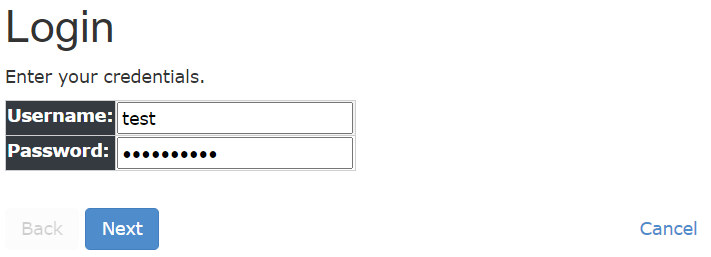
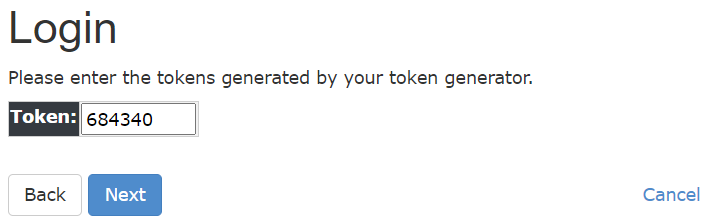
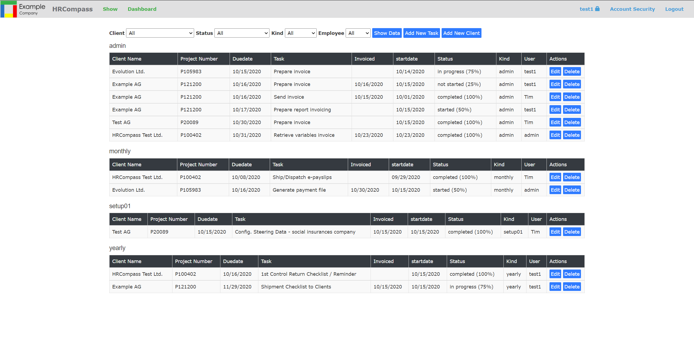
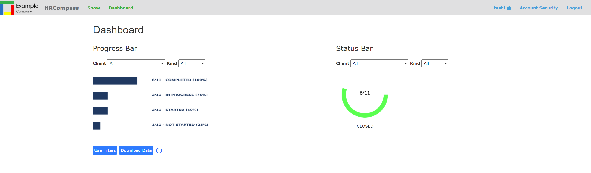
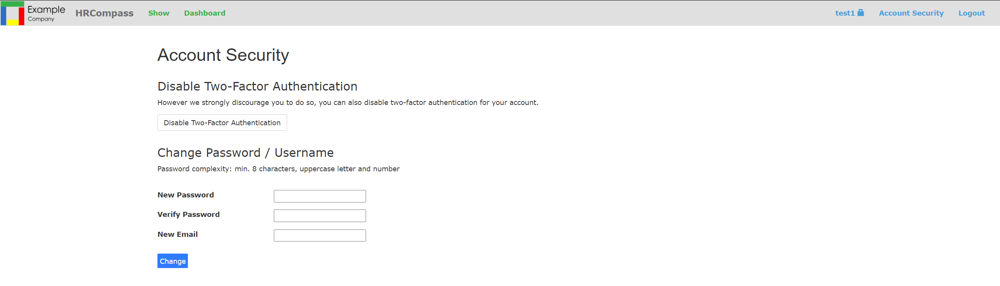

# CMS HRCompass
Manage workflow of Dynamics 365 Business Central customer assignment.


## Overview
Material designed for Django.  
Tested with Django 3.1, python 3.8.5 and mariadb 10.5.5 (and other databases)

The program contains:
* login page with two-factor authentification
* task overview with filters
* different edit pages
* reporting overview
* admin page

  

  

  

## Requirements
This tools are required for the installation:
* Python 3.8.5 [Python Installation Doc](https://docs.python.org/3/using/windows.html)
* Django 3.1 [Django Installation Doc](https://docs.djangoproject.com/en/3.1/topics/install/)
* Maria DB 10.5.5 [MariaDB installation](https://mariadb.com/kb/en/getting-installing-and-upgrading-mariadb/) (or other databases)
  
## Installation
### Install packages:  
```
pip install django-otp   
pip install django-two-factor-auth[phonenumbers] 
pip install sqlclient
pip install matplot
pip install xlsxwriter
pip install django-session-timeout
pip install mixer
pip install djecrety
```

### Problem with sqlclient installation
If there is any problem to install the sqlclient on a windows. To install the binary package follow this steps.
* Download mysqlclient wheel from: https://www.lfd.uci.edu/~gohlke/pythonlibs/#mysqlclient  
* Rename wheel to: mysqlclient-1.4.6-cp38-none-win32.whl
```
pip install mysqlclient-1.4.6-cp38-none-win32.whl
```

### Download Package:
* Download [HRCompass](https://www.github.com/seaic/cmshrcompass.git) from Github

### Create database:  
Create database and tables for application

Mysql(MariaDB):
```
mysql -u username -p password
CREATE DATABASE django_db;
```

PostgreSQL:
```
psql -u username
CREATE DATABASE django_db;
```

SQLite:
```
sqlite3 django_db.db
```

Edit *models.py*:  
Change by every *class meta* the following parameter:  
```
managed = True #False
```
Create tables:
```
python manage.py makemigrations
python manage.py migrate
```

### Settings:  

Before we can start the server we have to edit the DATABASE in *settings.py*  
Do not forget to set the environment variables SECRET_KEY and DATABASE_PASSWORD  

Generate SECRET_KEY
```
python manage.py djecrety
```

```python  
SECRET_KEY = get_env_value('SECRET_KEY')

DATABASES = {  
    'default': {  
        'ENGINE': 'django.db.backends.mysql', 
        'NAME': 'django_db',  
        'USER': 'root',  
        'PASSWORD': get_env_value('DATABASE_PASSWORD'),  
        'HOST': 'localhost',  
        'PORT': '3306',  
    }  
}  

```

### Tests

Automated testing is helpful for detecting errors. Test should rund after changes. Tests are stored in *test.py*.  
Run tests:  
```
python manage.py test
```

### Start Server:  

Go to the root directory in your project and start the server.  

```
python manage.py runserver  
```

Open: http://127.0.0.1:8000

## Create Production Environment
On a webserver:  
* Install python, python-devel and nginx
  
* Install dependencies:  
    ```
    pip install django django-otp django-two-factor-auth[phonenumbers] psycopg2-binary matplot xlswriter django-session-timeout mixer djecrety

    pip install gunicorn
    ```

* Copy the content of your project into */opt/[yourproject]*
    ```
    chown -R nginx:niginx /opt/[yourproject]
    ```
* Create a service for gunicorn, see https://www.howtoforge.com/how-to-install-django-on-centos-8/
  
* Configure Nginx for Django, see link above
  
* Change *DEBUG = True* to False in *settings.py*
  
* Apply css to admin site in production    
    ```
    python manage.py collectstatic
    ```
* Generate SECRET_KEY
    ```
    python manage.py djecrety
    ```
* Change database  
  Edit the *DATABASE* in *settings.py*
  Do not forget to set the environment variables SECRET_KEY and DATABASE_PASSWORD 

* Add tables to database  
  Set parameter *managed* to true in *models.py*
   ```
   python manage.py makemigrations hrcompass
   python manage.py migrate
   ```

* Start server and give rights
  ```
   chown -R nginx:nginx cmshrcompass
   systemctl start gunicorn
   systemctl start nginx
  ```
  Done!

## Getting help
For general questions regarding this package, please hop over to Stack Overflow. 
If you think there is an issue with this package, check if the issue is already listed (either open or closed), and file an issue if it's not.

## Contribute
For Contribution please use the Github functions:
* Sumbit issues to the [issue tracker](https://www.github.com/seaic/cmshrcompass/issues) on Github
* Fork the [source code](https://www.github.com/seaic/cmshrcompass.git) at Github
* Send a [pull request](https://www.github.com/seaic/cmshrcompass/pulls) with your changes

## Releases
Need a stable release? You can find them at [releases](https://www.github.com/seaic/cmshrcompass.git)

## Links
The tutorial is composed of the following tutorials:
* [Django CRUD Example](https://www.javatpoint.com/django-crud-application)
* [Django Two-Factor Auth](https://github.com/Bouke/django-two-factor-auth)

## Licensing
This project is licensed under the MIT license.